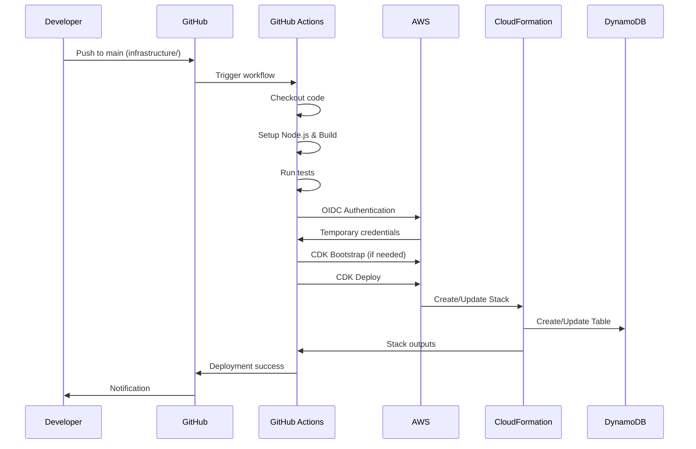
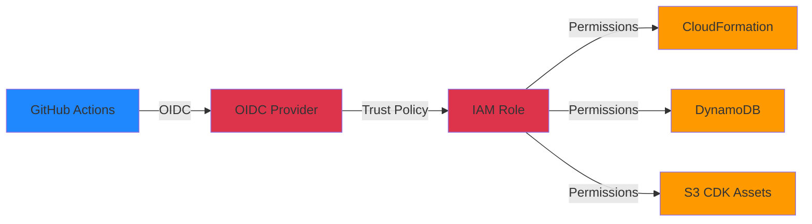

# CI/CD デプロイメント戦略

## 概要

CI/CDアーキテクチャとデプロイメント戦略について説明します。

## アーキテクチャ概要

### デプロイメントフロー

## セキュリティアーキテクチャ

### OIDC認証

- **認証方式**: OpenID Connect (OIDC)
- **プロバイダー**: GitHub Actions
- **利点**: 永続的な認証情報不要、一時的なセッショントークンのみ使用

### アクセス制御

### セキュリティ原則

- **最小権限**: IAMロールは必要最小限の権限のみを付与
- **リポジトリ制限**: 特定のGitHubリポジトリのみがロールを引き受け可能
- **一時認証情報**: セッショントークンは1時間で自動失効
- **暗号化**: データは保存時・転送時ともに暗号化

## デプロイメント戦略

### 自動デプロイ

- **トリガー**: `infrastructure/`配下のファイルが`main`ブランチにマージされた時
- **実行内容**: テスト → ビルド → デプロイ
- **失敗時**: 自動ロールバック（CloudFormation機能）

### 手動デプロイ

- **用途**: 緊急時の再デプロイ、特定環境へのデプロイ
- **環境選択**: dev / staging を選択可能
- **承認**: 不要（完全自動化）

## 環境管理

### 環境分離

- **dev**: 開発環境
- **staging**: ステージング環境
- **分離方法**: 環境ごとに独立したAWSリソース（テーブル名、スタック名に環境名を含む）

### 環境構成

各環境は以下を持ちます：
- 独立したDynamoDBテーブル
- 独立したCloudFormationスタック
- 独立したIAMロール

## 技術スタック

- **IaC**: AWS CDK (TypeScript)
- **CI/CD**: GitHub Actions
- **認証**: OIDC
- **デプロイ**: CloudFormation
- **テスト**: Jest (ユニットテスト)
