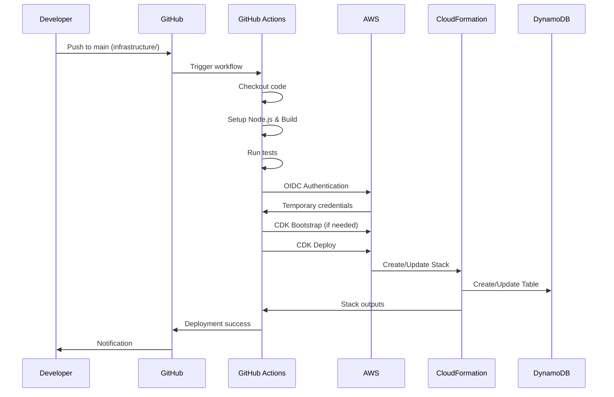
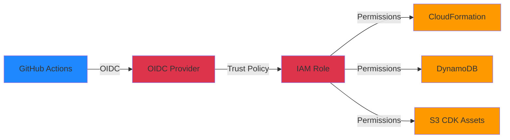

# CI/CD デプロイメント

## 概要

このドキュメントでは、spec-kit勤怠管理システムのAWS CDKインフラストラクチャのCI/CDデプロイメントフローについて説明します。

## デプロイメントフロー



## セキュリティ

### 認証・認可

- **OIDC認証**: GitHub ActionsとAWS間の認証に使用
- **一時認証情報**: 永続的なアクセスキー不要
- **IAMロール**: 最小権限原則に基づく権限設定
- **リポジトリ制限**: 特定のGitHubリポジトリのみアクセス可能

### アクセス制御



## GitHub Actions ワークフロー

### Deploy Workflow

**ファイル**: `.github/workflows/deploy-to-aws.yml`

**トリガー**:
- `main`ブランチへのpush（`infrastructure/**`パス）
- 手動実行（workflow_dispatch）

**主要ステップ**:
1. コードのチェックアウト
2. Node.js 22環境のセットアップ
3. 依存関係のインストール
4. TypeScriptビルド
5. ユニットテスト実行
6. OIDC認証
7. CDK Bootstrap（冪等）
8. CDK Deploy
9. スタック出力表示

### デプロイメント戦略

**自動デプロイ**:
- `infrastructure/`配下の変更が`main`ブランチにマージされると自動実行
- テストが失敗した場合はデプロイを中断

**手動デプロイ**:
- GitHub Actions UIから環境（dev/staging）を選択して実行
- 緊急時の再デプロイやロールバックに使用

## 初回セットアップ

### ステップ1: OIDCプロバイダーとIAMロールの作成

初回のみ、CloudFormationを使用してOIDCプロバイダーとIAMロールを手動で作成します。

1. AWSコンソールでCloudFormationサービスを開く
2. 新しいスタックを作成
3. `infrastructure/setup/bootstrap-oidc.yaml`テンプレートをアップロード
4. スタックを作成
5. OutputsタブからロールARNをコピー

### ステップ2: GitHub Secretsの設定

1. GitHubリポジトリのSettings > Secrets and variables > Actionsを開く
2. `AWS_ROLE_TO_ASSUME`に取得したロールARNを設定

### ステップ3: CDKデプロイ

1. GitHub Actionsタブを開く
2. "Deploy to AWS"ワークフローを実行
3. 環境として"dev"を選択

このデプロイでCDK管理のOIDCプロバイダーとIAMロールが作成されます。

### ステップ4: GitHub Secretsの更新

1. デプロイ完了後、CloudFormationコンソールで`SpecKit-Dev-Stack`のOutputsを確認
2. `GitHubActionsRoleArn`の値をコピー
3. GitHub Secretsの`AWS_ROLE_TO_ASSUME`を新しいARNに更新

### ステップ5: 初回CloudFormationスタックの削除

1. CloudFormationコンソールで初回に作成したスタックを選択
2. "削除"をクリック

以降はCDK管理のOIDCとIAMロールが使用されます。

## 通常運用

### デプロイフロー

1. `infrastructure/`配下のファイルを変更
2. PRを作成してレビュー
3. `main`ブランチにマージ
4. GitHub Actionsが自動的にデプロイを実行

### 手動デプロイ

1. GitHub Actionsタブを開く
2. "Deploy to AWS"ワークフローを選択
3. "Run workflow"をクリックして環境を選択

## トラブルシューティング

### CDK Bootstrapエラー

Bootstrapが必要な場合は、ワークフローが自動的に実行します。手動実行が必要な場合：

```bash
npx cdk bootstrap aws://ACCOUNT_ID/ap-northeast-1 --context environment=dev
```

### OIDC認証エラー

- GitHub Secretsの`AWS_ROLE_TO_ASSUME`が正しく設定されているか確認
- IAMロールのTrust Policyがリポジトリを許可しているか確認

### デプロイ失敗

- CloudFormationコンソールでスタックイベントを確認
- GitHub Actionsログで詳細なエラーメッセージを確認
- CloudFormationが自動的にロールバックを実行

## 監視

### ワークフロー実行履歴

- GitHub Actionsタブでワークフロー実行履歴を確認
- 失敗時のログ分析
- 成功率のトラッキング

### CloudFormationスタック

- AWSコンソールでスタックステータスを確認
- デプロイ履歴とイベントログの確認
