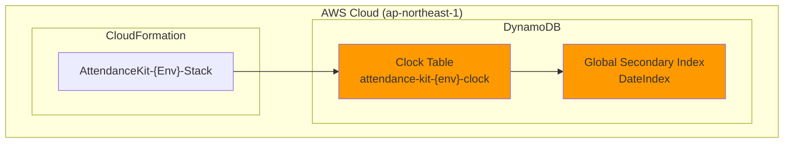

# DynamoDB Clock Table

## 概要

このドキュメントでは、DynamoDB Clock Tableの設計について説明します。

## データベース構成図



## DynamoDB テーブル設計

### テーブル構造

**テーブル名**: `attendance-kit-{environment}-clock`

#### Primary Key

| キー | 属性名 | 型 | 説明 |
|------|--------|-----|------|
| Partition Key | `userId` | String | ユーザーを識別する一意のID |
| Sort Key | `timestamp` | String | 打刻時刻（ISO 8601形式） |

#### 属性

| 属性名 | 型 | 必須 | 説明 |
|--------|-----|------|------|
| `userId` | String | ✓ | ユーザーID（Partition Key） |
| `timestamp` | String | ✓ | 打刻時刻（Sort Key、ISO 8601形式） |
| `date` | String | ✓ | 日付（YYYY-MM-DD形式、GSI用） |
| `type` | String | ✓ | 打刻種別（"clock-in" / "clock-out"） |
| `location` | String |  | 打刻場所（オプション） |
| `deviceId` | String |  | デバイスID（オプション） |

#### Global Secondary Index: DateIndex

| キー | 属性名 | 型 |
|------|--------|-----|
| Partition Key | `date` | String |
| Sort Key | `timestamp` | String |

**プロジェクション**: ALL（すべての属性）

### ER図

```mermaid
erDiagram
    ClockTable {
        string userId PK
        string timestamp SK
        string date "GSI PK"
        string type
        string location
        string deviceId
    }
    
    DateIndex {
        string date PK
        string timestamp SK
    }
    
    ClockTable ||--o{ DateIndex : "GSI"
```

## アクセスパターン

### パターン1: 特定ユーザーの全打刻記録を取得

**ユースケース**: ユーザーの勤怠履歴を表示

**クエリ**:
```typescript
const params = {
  TableName: 'attendance-kit-dev-clock',
  KeyConditionExpression: 'userId = :userId',
  ExpressionAttributeValues: {
    ':userId': 'user123'
  }
};

const result = await dynamodb.query(params).promise();
```

**効率性**: ✅ 高効率（Partition Keyでの直接クエリ）

---

### パターン2: 特定ユーザーの期間指定打刻記録を取得

**ユースケース**: 月次勤怠レポート

**クエリ**:
```typescript
const params = {
  TableName: 'attendance-kit-dev-clock',
  KeyConditionExpression: 'userId = :userId AND #timestamp BETWEEN :start AND :end',
  ExpressionAttributeNames: {
    '#timestamp': 'timestamp'
  },
  ExpressionAttributeValues: {
    ':userId': 'user123',
    ':start': '2025-12-01T00:00:00Z',
    ':end': '2025-12-31T23:59:59Z'
  }
};

const result = await dynamodb.query(params).promise();
```

**効率性**: ✅ 高効率（Partition Key + Sort Key範囲クエリ）

---

### パターン3: 特定日の全ユーザー打刻記録を取得

**ユースケース**: 日次出勤状況の確認

**クエリ**:
```typescript
const params = {
  TableName: 'attendance-kit-dev-clock',
  IndexName: 'DateIndex',
  KeyConditionExpression: '#date = :date',
  ExpressionAttributeNames: {
    '#date': 'date'
  },
  ExpressionAttributeValues: {
    ':date': '2025-12-25'
  }
};

const result = await dynamodb.query(params).promise();
```

**効率性**: ✅ 高効率（GSIでのPartition Keyクエリ）

---

### パターン4: 特定日時範囲の全ユーザー打刻記録を取得

**ユースケース**: 特定時間帯の出勤状況

**クエリ**:
```typescript
const params = {
  TableName: 'attendance-kit-dev-clock',
  IndexName: 'DateIndex',
  KeyConditionExpression: '#date = :date AND #timestamp BETWEEN :start AND :end',
  ExpressionAttributeNames: {
    '#date': 'date',
    '#timestamp': 'timestamp'
  },
  ExpressionAttributeValues: {
    ':date': '2025-12-25',
    ':start': '2025-12-25T09:00:00Z',
    ':end': '2025-12-25T18:00:00Z'
  }
};

const result = await dynamodb.query(params).promise();
```

**効率性**: ✅ 高効率（GSIでのPartition Key + Sort Key範囲クエリ）

## データ例

```json
{
  "userId": "user123",
  "timestamp": "2025-12-25T09:00:00Z",
  "date": "2025-12-25",
  "type": "clock-in",
  "location": "Tokyo Office",
  "deviceId": "device-abc123"
}
```

```json
{
  "userId": "user123",
  "timestamp": "2025-12-25T18:00:00Z",
  "date": "2025-12-25",
  "type": "clock-out",
  "location": "Tokyo Office",
  "deviceId": "device-abc123"
}
```

## インフラストラクチャ設定

### DynamoDB設定

| 設定項目 | 値 | 理由 |
|---------|-----|------|
| **課金モード** | Pay-Per-Request | 予測困難なトラフィックに対応、低トラフィック時のコスト効率 |
| **暗号化** | AWS管理キー | セキュリティ要件を満たしつつ追加コストなし |
| **PITR** | 有効 | データ保護、35日間のバックアップ |
| **削除ポリシー** | RETAIN | 誤削除防止、CloudFormationスタック削除時もデータ保持 |
| **リージョン** | ap-northeast-1 | 東京リージョン、低レイテンシ |

### コストタグ

すべてのリソースには以下のタグが付与されます：

- `Environment`: dev / staging
- `Project`: attendance-kit
- `ManagedBy`: CDK
- `CostCenter`: Engineering

## データセキュリティ

### データ保護

- **保存時暗号化**: AWS管理キー（SSE-S3相当）
- **転送時暗号化**: HTTPS
- **PITR**: 35日間の継続バックアップ
- **削除ポリシー**: RETAINによる誤削除防止

## 監視とメトリクス

### 基本メトリクス（無料）

CloudWatchで利用可能な基本メトリクス：

- **ConsumedReadCapacityUnits**: 読み込み使用量
- **ConsumedWriteCapacityUnits**: 書き込み使用量
- **UserErrors**: クライアントエラー数
- **SystemErrors**: サーバーエラー数

### コスト最適化

初期段階ではコスト削減のため、以下は実装していません：

- ❌ CloudWatchアラーム
- ❌ カスタムメトリクス
- ❌ 詳細なモニタリング
- ❌ SNS通知

## スケーラビリティ

### DynamoDBの自動スケーリング

Pay-Per-Request課金モードにより、以下が自動的に対応されます：

- トラフィック急増時の自動スケールアップ
- 低トラフィック時の自動スケールダウン
- パフォーマンスSLA: 99.99%可用性

### GSIのスケーラビリティ

- メインテーブルと同じPay-Per-Request課金
- 独立したスケーリング
- スパースインデックス対応

## ディザスタリカバリ

### バックアップ戦略

1. **PITR (Point-in-Time Recovery)**
   - 35日間の継続バックアップ
   - 秒単位のリカバリポイント
   - リージョン内リカバリ

2. **削除ポリシー**
   - CloudFormationスタック削除時もテーブル保持
   - 手動削除のみでデータ削除可能

### リカバリ手順

```bash
# PITRからのリカバリ例
aws dynamodb restore-table-to-point-in-time \
  --source-table-name attendance-kit-dev-clock \
  --target-table-name attendance-kit-dev-clock-restored \
  --restore-date-time 2025-12-25T10:00:00Z
```

## パフォーマンス最適化

### クエリ最適化

1. **Partition Keyでのフィルタリング**: 必ずPartition Keyを使用
2. **Sort Keyでの範囲クエリ**: 期間指定に効率的
3. **GSIの活用**: 日付ベースのクエリにDateIndexを使用
4. **プロジェクション**: GSIはALL（必要に応じてKEYS_ONLYに変更可能）

### ベストプラクティス

- ✅ 一度に大量のデータを取得する場合はPaginationを使用
- ✅ Scanは避け、QueryまたはGetItemを使用
- ✅ BatchGetItemで複数アイテムを効率的に取得
- ✅ Conditional Writesで楽観的ロック実装

## 将来の拡張性

### 考えられる拡張

1. **DynamoDB Streams**: リアルタイム通知、イベント処理
2. **Lambda統合**: 自動集計、アラート
3. **Time-to-Live (TTL)**: 古いデータの自動削除
4. **グローバルテーブル**: マルチリージョン対応
5. **追加GSI**: 新しいアクセスパターンに対応

### 制約事項

- テーブル削除時のデータ保護のため、削除ポリシーはRETAIN
- スタック削除前にテーブルの手動削除が必要な場合は、CloudFormationコンソールで対応

