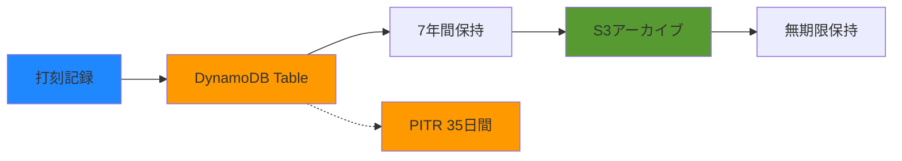

# Clock Table ビジネス要件

## 概要

このドキュメントでは、Clock Table（打刻テーブル）のビジネス要件と使用方法について説明します。

## ビジネスゴール

### 主要目標

1. **正確な勤怠記録**: 従業員の出退勤時刻を正確に記録
2. **リアルタイム性**: 打刻データをリアルタイムで記録・参照
3. **スケーラビリティ**: 組織の成長に対応できる拡張性
4. **コスト効率**: 使用量に応じた課金で無駄なコストを削減
5. **データ保護**: 誤削除や障害からのデータ保護

### 成功指標

- 打刻記録の99.9%以上の正確性
- 打刻から記録完了まで3秒以内
- 月間コストが予算内（初期段階: $10以下）
- データ損失ゼロ
- 99.9%以上のシステム可用性

## ユースケース

### UC-001: 出勤打刻

**アクター**: 従業員

**前提条件**: 
- 従業員が認証済み
- 現在時刻が出勤可能時間内

**フロー**:
1. 従業員が「出勤」ボタンをクリック
2. システムが現在時刻を取得
3. DynamoDBにclock-in記録を保存
4. 従業員に確認メッセージを表示

**データ例**:
```json
{
  "userId": "emp123",
  "timestamp": "2025-12-25T09:00:00Z",
  "date": "2025-12-25",
  "type": "clock-in",
  "location": "Tokyo Office",
  "deviceId": "web-browser-chrome"
}
```

**ビジネスルール**:
- 同じ日に複数回の出勤打刻は警告を表示
- 出勤時刻が業務開始時刻より早い場合は早朝出勤として記録

---

### UC-002: 退勤打刻

**アクター**: 従業員

**前提条件**:
- 従業員が認証済み
- 同日に出勤打刻が存在

**フロー**:
1. 従業員が「退勤」ボタンをクリック
2. システムが現在時刻を取得
3. DynamoDBにclock-out記録を保存
4. 勤務時間を計算して表示

**データ例**:
```json
{
  "userId": "emp123",
  "timestamp": "2025-12-25T18:00:00Z",
  "date": "2025-12-25",
  "type": "clock-out",
  "location": "Tokyo Office",
  "deviceId": "web-browser-chrome"
}
```

**ビジネスルール**:
- 出勤打刻なしで退勤打刻した場合はエラー
- 退勤時刻が業務終了時刻より遅い場合は残業として記録

---

### UC-003: 個人勤怠履歴の参照

**アクター**: 従業員

**前提条件**: 従業員が認証済み

**フロー**:
1. 従業員が勤怠履歴画面を開く
2. システムが当月の打刻記録を取得
3. 日別にグループ化して表示
4. 各日の勤務時間を計算

**クエリ例**:
```typescript
// ユーザーの月次勤怠取得
const startDate = '2025-12-01T00:00:00Z';
const endDate = '2025-12-31T23:59:59Z';

const params = {
  TableName: 'attendance-kit-dev-clock',
  KeyConditionExpression: 'userId = :userId AND #timestamp BETWEEN :start AND :end',
  ExpressionAttributeNames: { '#timestamp': 'timestamp' },
  ExpressionAttributeValues: {
    ':userId': 'emp123',
    ':start': startDate,
    ':end': endDate
  }
};
```

**表示例**:
```
2025年12月 勤怠履歴

2025-12-25 (月)
  出勤: 09:00
  退勤: 18:00
  勤務時間: 9時間

2025-12-24 (日)
  休日

2025-12-23 (土)
  休日
```

---

### UC-004: 日次出勤状況の確認（管理者）

**アクター**: 人事担当者、マネージャー

**前提条件**: 管理者権限を持つユーザーが認証済み

**フロー**:
1. 管理者が日次出勤状況画面を開く
2. 対象日を選択
3. システムが該当日の全従業員の打刻記録を取得
4. 出勤状況をサマリー表示

**クエリ例**:
```typescript
// 特定日の全ユーザー打刻取得
const params = {
  TableName: 'attendance-kit-dev-clock',
  IndexName: 'DateIndex',
  KeyConditionExpression: '#date = :date',
  ExpressionAttributeNames: { '#date': 'date' },
  ExpressionAttributeValues: { ':date': '2025-12-25' }
};
```

**表示例**:
```
2025-12-25 (月) 出勤状況

出勤済み: 45名 (90%)
未出勤: 5名 (10%)

詳細:
  山田太郎: 09:00 出勤
  佐藤花子: 09:15 出勤
  鈴木一郎: 未出勤
  ...
```

---

### UC-005: 月次勤怠レポート生成

**アクター**: 人事担当者

**前提条件**: 管理者権限を持つユーザーが認証済み

**フロー**:
1. 人事担当者が月次レポート画面を開く
2. 対象年月を選択
3. システムが全従業員の月次勤怠を集計
4. CSV形式でレポートをダウンロード

**処理内容**:
- 各従業員の出勤日数
- 総勤務時間
- 平均出勤時刻
- 平均退勤時刻
- 残業時間

---

## データ保持ポリシー

### 保持期間

| データ種別 | 保持期間 | 理由 |
|-----------|---------|------|
| 通常の打刻記録 | 7年間 | 労働基準法に基づく保存義務 |
| バックアップデータ | 35日間 | PITR機能による自動バックアップ |
| アーカイブデータ | 無期限 | 法令遵守、監査対応 |

### データライフサイクル



### アーカイブ戦略（将来実装）

1. 7年経過したデータを自動的にS3 Glacierにアーカイブ
2. 必要に応じて復元可能
3. コスト最適化のため低頻度アクセスストレージ使用

## ビジネスルール

### 打刻ルール

1. **1日1回の出退勤**: 基本的に1日あたり出勤1回、退勤1回
2. **修正申請**: 打刻忘れや誤打刻は上長承認で修正可能（将来実装）
3. **位置情報**: オプションで打刻場所を記録
4. **デバイス情報**: 不正防止のためデバイス情報を記録

### 勤務時間計算

- **標準勤務時間**: 9:00-18:00（8時間）
- **休憩時間**: 12:00-13:00（1時間、自動控除）
- **残業**: 18:00以降の勤務時間
- **早朝出勤**: 9:00より前の出勤

### 異常検知（将来実装）

- 24時間以上の連続勤務
- 深夜帯（22:00-5:00）の打刻
- 休日出勤
- 月間残業時間が80時間超過

## コスト分析

### 想定トラフィック

**初期段階（50名の組織）**:
- 1日あたり打刻: 200回（出勤+退勤 × 50名 × 2回）
- 1ヶ月あたり打刻: 4,000回（20営業日）
- 1ヶ月あたり読み取り: 20,000回（履歴参照、レポート生成）

### コスト見積もり

**DynamoDB Pay-Per-Request料金（東京リージョン）**:
- 書き込み: $1.4297 per million writes
- 読み取り: $0.2858 per million reads

**月間コスト**:
```
書き込み: 4,000回 × $1.4297 / 1,000,000 = $0.006
読み取り: 20,000回 × $0.2858 / 1,000,000 = $0.006
ストレージ: 1GB以下（最初の25GB無料）
合計: 約$0.01 / 月
```

**年間コスト**: 約$0.12

**スケール時（500名）**:
- 月間書き込み: 40,000回
- 月間読み取り: 200,000回
- 月間コスト: 約$0.10
- 年間コスト: 約$1.20

### コスト最適化戦略

1. **Pay-Per-Request課金**: 使用量に応じた課金で無駄なコスト削減
2. **GSIの最適化**: プロジェクションを必要最小限に（将来）
3. **データアーカイブ**: 古いデータをS3に移行（将来）
4. **アラーム最小化**: 初期段階は無料の基本メトリクスのみ使用

## コンプライアンス

### 労働基準法対応

- 労働時間の正確な記録
- 7年間の保存義務
- 従業員本人が記録を確認可能

### 個人情報保護

- アクセス制御: IAMによる厳格な権限管理
- 暗号化: 保存時・転送時の暗号化
- 監査ログ: CloudTrailによるアクセス記録

### GDPR対応（将来）

- データポータビリティ: CSV/JSON形式でのエクスポート
- 削除権: 従業員退職時のデータ削除手続き
- 同意管理: 位置情報記録の同意取得

## ユーザーストーリー

### エピック: 基本的な勤怠管理

**ストーリー1**: 出退勤打刻
```
As a 従業員
I want to 出勤・退勤時にボタンをクリックするだけで打刻できる
So that 正確な勤務時間が記録される
```

**受入条件**:
- [ ] 出勤ボタンで現在時刻が記録される
- [ ] 退勤ボタンで現在時刻が記録される
- [ ] 打刻後に確認メッセージが表示される
- [ ] オフライン時はエラーメッセージを表示

---

**ストーリー2**: 勤怠履歴参照
```
As a 従業員
I want to 自分の勤怠履歴を月別に確認できる
So that 勤務時間を把握できる
```

**受入条件**:
- [ ] 当月の勤怠が日別に表示される
- [ ] 各日の出勤・退勤時刻が表示される
- [ ] 勤務時間が自動計算される
- [ ] 前月の履歴も参照できる

---

**ストーリー3**: 出勤状況確認
```
As a マネージャー
I want to チームメンバーの当日の出勤状況を確認できる
So that チーム運営を円滑にできる
```

**受入条件**:
- [ ] 当日の出勤状況がリアルタイムで表示される
- [ ] 出勤済み・未出勤が一目でわかる
- [ ] 各メンバーの出勤時刻が表示される

---

### エピック: レポーティング

**ストーリー4**: 月次レポート
```
As a 人事担当者
I want to 全従業員の月次勤怠レポートをCSVでダウンロードできる
So that 給与計算や労務管理に活用できる
```

**受入条件**:
- [ ] 月次レポートがCSV形式でダウンロードできる
- [ ] 従業員別に集計されている
- [ ] 出勤日数、総勤務時間が含まれる
- [ ] 残業時間が計算されている

## よくある質問（FAQ）

**Q: 打刻を忘れた場合はどうすればよいですか？**
A: 現在は手動での修正が必要です。将来的には修正申請機能を実装予定です。

**Q: 位置情報は必須ですか？**
A: オプションです。設定により記録の有無を選択できます。

**Q: データはどのくらいの期間保存されますか？**
A: 労働基準法に基づき7年間保存されます。

**Q: 休日出勤の記録はどうなりますか？**
A: 通常の打刻と同様に記録されます。管理画面で休日出勤として識別可能です。

**Q: 複数デバイスから打刻できますか？**
A: はい、PC、スマートフォン、タブレットなど複数デバイスに対応しています。

## 今後の機能拡張

### 短期（3ヶ月以内）
- [ ] 打刻修正申請機能
- [ ] プッシュ通知（打刻忘れアラート）
- [ ] ダッシュボード機能

### 中期（6ヶ月以内）
- [ ] 休暇申請機能
- [ ] 残業申請・承認ワークフロー
- [ ] 詳細なアナリティクス

### 長期（1年以内）
- [ ] モバイルアプリ
- [ ] 顔認証打刻
- [ ] AI予測（勤怠パターン分析）

