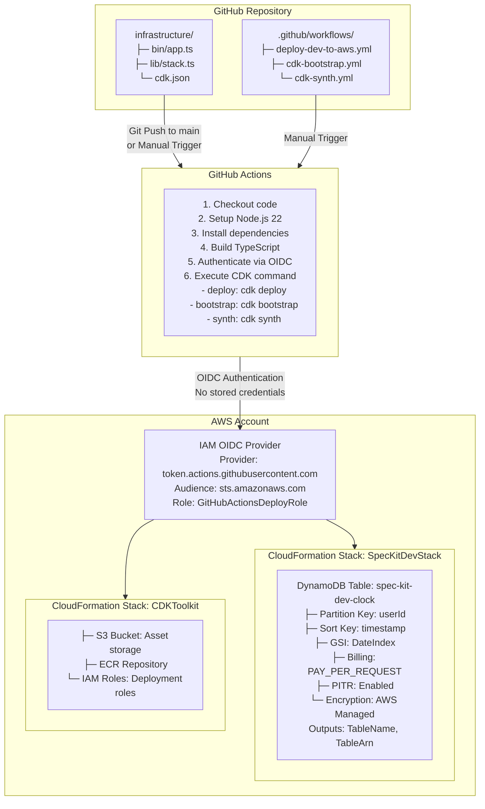
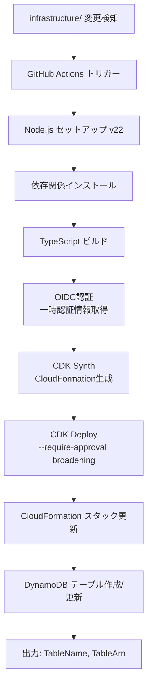
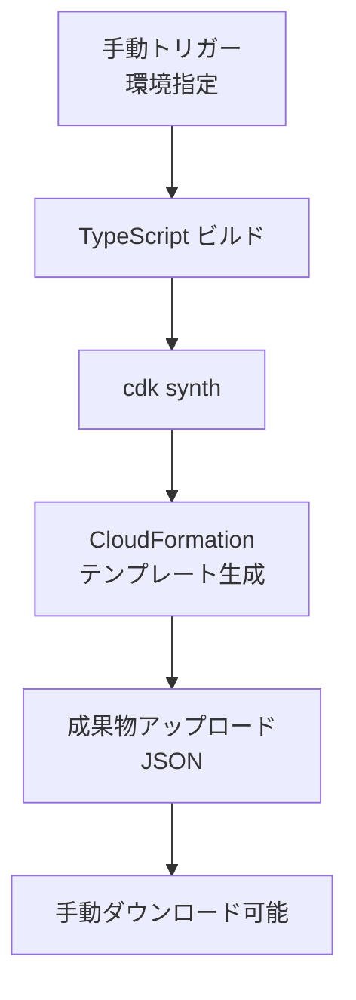

# 技術実装計画: AWS DynamoDB Clock Table CI/CD

**機能ブランチ**: `copilot/build-ci-for-aws-deployment`  
**作成日**: 2025-12-25  
**ステータス**: レビュー待ち  
**仕様書**: [spec.md](./spec.md)

## 1. 技術スタック選定

### 1.1 インフラストラクチャ

- **AWS CDK**: v2.x (TypeScript)
  - 理由: Infrastructure as Code、型安全性、CloudFormation抽象化
  - 代替案検討: Terraform → 却下（AWS特化でCDKの方が開発効率が高い）

- **DynamoDB**: On-Demand課金モード
  - 理由: サーバーレス、スケーラブル、低トラフィック時のコスト効率
  - 設定:
    - PITR有効化（データ保護）
    - AWS管理キー暗号化（セキュリティ）
    - RETAIN削除ポリシー（誤削除防止）

### 1.2 CI/CD

- **GitHub Actions**: ワークフロー実行環境
  - 理由: GitHub統合、OIDC対応、無料枠で十分
  - ランナー: ubuntu-latest
  - Node.js: v22 (LTS)

- **OIDC認証**: AWS認証方式
  - 理由: 認証情報保存不要、セキュリティベストプラクティス
  - 設定: GitHub OIDC Provider + IAM Role

### 1.3 開発ツール

- **TypeScript**: v5.x
- **AWS CDK CLI**: グローバルまたはnpx経由
- **Node.js**: v22 LTS

## 2. アーキテクチャ設計

### 2.1 システム構成図



### 2.2 デプロイメントフロー

#### 自動デプロイ (deploy-dev-to-aws.yml)


#### 手動Bootstrap (cdk-bootstrap.yml)
```mermaid
flowchart TD
    A[手動トリガー<br/>環境・リージョン指定] --> B[OIDC認証]
    B --> C[cdk bootstrap<br/>aws://{ACCOUNT}/{REGION}]
    C --> D[CDKToolkit スタック作成]
    D --> E[S3バケット・IAMロール<br/>準備完了]
```

#### 手動Synth (cdk-synth.yml)


## 3. CDKスタック構造

### 3.1 ディレクトリ構成

```
infrastructure/
├── bin/
│   └── app.ts                    # CDKアプリエントリーポイント
├── lib/
│   └── spec-kit-dev-stack.ts     # DynamoDBスタック定義
├── test/
│   └── spec-kit-dev-stack.test.ts # ユニットテスト
├── cdk.json                       # CDK設定
├── package.json                   # 依存関係
├── tsconfig.json                  # TypeScript設定
└── README.md                      # セットアップ手順
```

### 3.2 CDK Stack実装詳細

#### bin/app.ts
```typescript
#!/usr/bin/env node
import 'source-map-support/register';
import * as cdk from 'aws-cdk-lib';
import { SpecKitDevStack } from '../lib/spec-kit-dev-stack';

const app = new cdk.App();

// 環境設定
const env = {
  account: process.env.CDK_DEFAULT_ACCOUNT,
  region: process.env.CDK_DEFAULT_REGION || 'ap-northeast-1',
};

// Stackインスタンス作成
new SpecKitDevStack(app, 'SpecKitDevStack', {
  env,
  description: 'DynamoDB clock table for spec-kit attendance system (dev environment)',
  tags: {
    Environment: 'dev',
    Project: 'spec-kit',
    ManagedBy: 'CDK',
  },
});

app.synth();
```

#### lib/spec-kit-dev-stack.ts
```typescript
import * as cdk from 'aws-cdk-lib';
import { Construct } from 'constructs';
import * as dynamodb from 'aws-cdk-lib/aws-dynamodb';

export class SpecKitDevStack extends cdk.Stack {
  constructor(scope: Construct, id: string, props?: cdk.StackProps) {
    super(scope, id, props);

    // DynamoDB Clock Table
    const clockTable = new dynamodb.Table(this, 'ClockTable', {
      tableName: 'spec-kit-dev-clock',
      partitionKey: {
        name: 'userId',
        type: dynamodb.AttributeType.STRING,
      },
      sortKey: {
        name: 'timestamp',
        type: dynamodb.AttributeType.STRING,
      },
      billingMode: dynamodb.BillingMode.PAY_PER_REQUEST,
      encryption: dynamodb.TableEncryption.AWS_MANAGED,
      pointInTimeRecovery: true,
      removalPolicy: cdk.RemovalPolicy.RETAIN, // データ保護
    });

    // Global Secondary Index: DateIndex
    clockTable.addGlobalSecondaryIndex({
      indexName: 'DateIndex',
      partitionKey: {
        name: 'date',
        type: dynamodb.AttributeType.STRING,
      },
      sortKey: {
        name: 'timestamp',
        type: dynamodb.AttributeType.STRING,
      },
      projectionType: dynamodb.ProjectionType.ALL,
    });

    // CloudFormation Outputs
    new cdk.CfnOutput(this, 'TableName', {
      value: clockTable.tableName,
      description: 'DynamoDB clock table name',
      exportName: 'SpecKitDevClockTableName',
    });

    new cdk.CfnOutput(this, 'TableArn', {
      value: clockTable.tableArn,
      description: 'DynamoDB clock table ARN',
      exportName: 'SpecKitDevClockTableArn',
    });
  }
}
```

### 3.3 依存関係 (package.json)

```json
{
  "name": "spec-kit-infrastructure",
  "version": "1.0.0",
  "scripts": {
    "build": "tsc",
    "watch": "tsc -w",
    "test": "jest",
    "cdk": "cdk"
  },
  "devDependencies": {
    "@types/jest": "^29.5.0",
    "@types/node": "22.x",
    "aws-cdk": "^2.x",
    "jest": "^29.5.0",
    "ts-jest": "^29.1.0",
    "ts-node": "^10.9.1",
    "typescript": "~5.3.0"
  },
  "dependencies": {
    "aws-cdk-lib": "^2.x",
    "constructs": "^10.0.0",
    "source-map-support": "^0.5.21"
  }
}
```

## 4. GitHub Actions ワークフロー設計

### 4.1 Deploy Workflow (.github/workflows/deploy-dev-to-aws.yml)

```yaml
name: Deploy Dev to AWS

on:
  push:
    branches:
      - main
    paths:
      - 'infrastructure/**'
  workflow_dispatch:
    inputs:
      environment:
        description: 'Environment to deploy'
        required: true
        default: 'dev'
        type: choice
        options:
          - dev
          - staging

permissions:
  id-token: write   # OIDC認証に必要
  contents: read

jobs:
  deploy:
    runs-on: ubuntu-latest
    environment: ${{ inputs.environment || 'dev' }}
    
    steps:
      - name: Checkout code
        uses: actions/checkout@v4

      - name: Setup Node.js 22
        uses: actions/setup-node@v4
        with:
          node-version: '22'
          cache: 'npm'
          cache-dependency-path: infrastructure/package-lock.json

      - name: Install dependencies
        working-directory: infrastructure
        run: npm ci

      - name: Build TypeScript
        working-directory: infrastructure
        run: npm run build

      - name: Configure AWS credentials via OIDC
        uses: aws-actions/configure-aws-credentials@v4
        with:
          role-to-assume: ${{ secrets.AWS_ROLE_TO_ASSUME }}
          aws-region: ap-northeast-1

      - name: CDK Synth
        working-directory: infrastructure
        run: npx cdk synth

      - name: CDK Deploy
        working-directory: infrastructure
        run: npx cdk deploy --require-approval broadening --all

      - name: Output deployment results
        run: |
          echo "Deployment completed successfully"
          echo "Stack outputs:"
          aws cloudformation describe-stacks \
            --stack-name SpecKitDevStack \
            --query 'Stacks[0].Outputs' \
            --output table
```

### 4.2 Bootstrap Workflow (.github/workflows/cdk-bootstrap.yml)

```yaml
name: CDK Bootstrap

on:
  workflow_dispatch:
    inputs:
      environment:
        description: 'Environment (dev/staging)'
        required: true
        type: choice
        options:
          - dev
          - staging
      region:
        description: 'AWS Region'
        required: true
        default: 'ap-northeast-1'
        type: string

permissions:
  id-token: write
  contents: read

jobs:
  bootstrap:
    runs-on: ubuntu-latest
    environment: ${{ inputs.environment }}
    
    steps:
      - name: Checkout code
        uses: actions/checkout@v4

      - name: Setup Node.js 22
        uses: actions/setup-node@v4
        with:
          node-version: '22'
          cache: 'npm'
          cache-dependency-path: infrastructure/package-lock.json

      - name: Install dependencies
        working-directory: infrastructure
        run: npm ci

      - name: Configure AWS credentials via OIDC
        uses: aws-actions/configure-aws-credentials@v4
        with:
          role-to-assume: ${{ secrets.AWS_ROLE_TO_ASSUME }}
          aws-region: ${{ inputs.region }}

      - name: CDK Bootstrap
        working-directory: infrastructure
        run: |
          ACCOUNT_ID=$(aws sts get-caller-identity --query Account --output text)
          npx cdk bootstrap aws://${ACCOUNT_ID}/${{ inputs.region }}

      - name: Verify bootstrap
        run: |
          echo "Bootstrap completed for account/region:"
          aws sts get-caller-identity
          aws cloudformation describe-stacks \
            --stack-name CDKToolkit \
            --region ${{ inputs.region }} \
            --query 'Stacks[0].StackStatus'
```

### 4.3 Synth Workflow (.github/workflows/cdk-synth.yml)

```yaml
name: CDK Synth

on:
  workflow_dispatch:
    inputs:
      environment:
        description: 'Environment (dev/staging)'
        required: true
        default: 'dev'
        type: choice
        options:
          - dev
          - staging

permissions:
  contents: read

jobs:
  synth:
    runs-on: ubuntu-latest
    
    steps:
      - name: Checkout code
        uses: actions/checkout@v4

      - name: Setup Node.js 22
        uses: actions/setup-node@v4
        with:
          node-version: '22'
          cache: 'npm'
          cache-dependency-path: infrastructure/package-lock.json

      - name: Install dependencies
        working-directory: infrastructure
        run: npm ci

      - name: Build TypeScript
        working-directory: infrastructure
        run: npm run build

      - name: CDK Synth
        working-directory: infrastructure
        run: npx cdk synth --output ./cdk.out

      - name: Upload CloudFormation templates
        uses: actions/upload-artifact@v4
        with:
          name: cloudformation-templates-${{ inputs.environment }}
          path: infrastructure/cdk.out/*.template.json
          retention-days: 30

      - name: Summary
        run: |
          echo "✅ CloudFormation templates generated successfully"
          echo "📦 Templates available as artifacts for manual review"
          echo "Environment: ${{ inputs.environment }}"
```

## 5. OIDC認証フロー

### 5.1 AWS側セットアップ (手動 - 初回のみ)

#### IAM OIDC Provider作成
```bash
aws iam create-open-id-connect-provider \
  --url https://token.actions.githubusercontent.com \
  --client-id-list sts.amazonaws.com \
  --thumbprint-list 6938fd4d98bab03faadb97b34396831e3780aea1
```

#### IAM Role作成 (Trust Policy)
```json
{
  "Version": "2012-10-17",
  "Statement": [
    {
      "Effect": "Allow",
      "Principal": {
        "Federated": "arn:aws:iam::{ACCOUNT_ID}:oidc-provider/token.actions.githubusercontent.com"
      },
      "Action": "sts:AssumeRoleWithWebIdentity",
      "Condition": {
        "StringEquals": {
          "token.actions.githubusercontent.com:aud": "sts.amazonaws.com"
        },
        "StringLike": {
          "token.actions.githubusercontent.com:sub": "repo:goataka/spec-kit-with-coding-agent:*"
        }
      }
    }
  ]
}
```

#### IAM Policy (最小権限)
```json
{
  "Version": "2012-10-17",
  "Statement": [
    {
      "Effect": "Allow",
      "Action": [
        "cloudformation:*",
        "dynamodb:*",
        "s3:*",
        "iam:GetRole",
        "iam:PassRole",
        "sts:GetCallerIdentity"
      ],
      "Resource": "*"
    }
  ]
}
```

### 5.2 GitHub Secrets設定

| Secret名 | 値 | 説明 |
|----------|-----|------|
| `AWS_ROLE_TO_ASSUME` | `arn:aws:iam::{ACCOUNT_ID}:role/GitHubActionsDeployRole` | OIDCで引き受けるIAMロールARN |

## 6. DynamoDB設計詳細

### 6.1 テーブル構造

#### Primary Key
- **Partition Key**: `userId` (String)
  - ユーザーごとにデータを分散
  - ユーザー単位のクエリに最適化
  
- **Sort Key**: `timestamp` (String, ISO 8601)
  - 時系列順にソート
  - 範囲クエリ対応 (特定期間の打刻取得)

#### Global Secondary Index: DateIndex
- **Partition Key**: `date` (String, YYYY-MM-DD)
  - 日付単位でデータ分散
  - 特定日の全ユーザー打刻取得に最適化
  
- **Sort Key**: `timestamp` (String)
  - 日付内で時系列順ソート

#### 属性
```typescript
{
  userId: string,        // PK: ユーザーID
  timestamp: string,     // SK: ISO 8601形式 (例: "2025-12-25T09:00:00Z")
  date: string,          // GSI PK: YYYY-MM-DD形式 (例: "2025-12-25")
  type: string,          // "clock-in" | "clock-out"
  location?: string,     // オプション: 打刻場所
  deviceId?: string,     // オプション: デバイスID
}
```

### 6.2 クエリパターン

#### パターン1: 特定ユーザーの全打刻取得
```typescript
// Primary Key Query
const params = {
  TableName: 'spec-kit-dev-clock',
  KeyConditionExpression: 'userId = :userId',
  ExpressionAttributeValues: {
    ':userId': 'user123'
  }
};
```

#### パターン2: 特定ユーザーの期間指定打刻取得
```typescript
// Primary Key + Range Query
const params = {
  TableName: 'spec-kit-dev-clock',
  KeyConditionExpression: 'userId = :userId AND #timestamp BETWEEN :start AND :end',
  ExpressionAttributeNames: {
    '#timestamp': 'timestamp'
  },
  ExpressionAttributeValues: {
    ':userId': 'user123',
    ':start': '2025-12-01T00:00:00Z',
    ':end': '2025-12-31T23:59:59Z'
  }
};
```

#### パターン3: 特定日の全ユーザー打刻取得
```typescript
// GSI Query
const params = {
  TableName: 'spec-kit-dev-clock',
  IndexName: 'DateIndex',
  KeyConditionExpression: '#date = :date',
  ExpressionAttributeNames: {
    '#date': 'date'
  },
  ExpressionAttributeValues: {
    ':date': '2025-12-25'
  }
};
```

### 6.3 データ保護戦略

- **Point-in-Time Recovery (PITR)**: 35日間の継続バックアップ
- **AWS Managed Encryption**: 保存時暗号化
- **RETAIN Removal Policy**: CloudFormationスタック削除時もテーブル保持
- **On-Demand Billing**: トラフィック急増時も自動スケール

## 7. セキュリティ考慮事項

### 7.1 認証・認可

- ✅ OIDC使用により永続認証情報不要
- ✅ IAMロールは最小権限原則に従う
- ✅ GitHub環境ごとに異なる認証情報使用可能

### 7.2 データ保護

- ✅ 保存時暗号化 (AWS Managed Key)
- ✅ 転送時暗号化 (HTTPS)
- ✅ PITR有効化 (誤削除・誤更新対策)
- ✅ RETAIN削除ポリシー (CloudFormation誤削除対策)

### 7.3 アクセス制御

- ✅ IAMロールによるAWSリソースアクセス制御
- ✅ GitHub環境シークレットによる機密情報保護
- ✅ リポジトリ限定のOIDC信頼ポリシー

### 7.4 監査・ログ

- ✅ CloudFormationイベントログ
- ✅ GitHub Actions実行ログ
- ✅ AWS CloudTrail (DynamoDB API呼び出し記録)

## 8. デプロイメント戦略

### 8.1 初回セットアップ手順

1. **AWS OIDCプロバイダー作成** (手動)
   ```bash
   aws iam create-open-id-connect-provider \
     --url https://token.actions.githubusercontent.com \
     --client-id-list sts.amazonaws.com
   ```

2. **IAMロール作成** (手動 または CDK synthで生成したテンプレートを使用)
   - Trust Policy設定
   - 必要なIAMポリシーをアタッチ

3. **GitHub Secrets設定** (手動)
   - `AWS_ROLE_TO_ASSUME`を設定

4. **CDK Bootstrap実行** (GitHub Actions手動トリガー)
   - ワークフロー: `cdk-bootstrap.yml`
   - 入力: dev, ap-northeast-1

5. **初回デプロイ実行** (GitHub Actions手動トリガー)
   - ワークフロー: `deploy-dev-to-aws.yml`
   - 入力: dev

### 8.2 通常運用時のデプロイ

1. **開発者がinfrastructure/配下を変更**
2. **PRを作成し、レビュー**
3. **mainブランチにマージ**
4. **GitHub Actionsが自動実行**
5. **DynamoDBテーブル更新**
6. **CloudFormation出力を確認**

### 8.3 ロールバック戦略

- CloudFormationの自動ロールバック機能を活用
- デプロイ失敗時は前の安定状態に自動復帰
- 手動ロールバック: 以前のCloudFormationスタックバージョンに戻す

## 9. テスト戦略

### 9.1 単体テスト (CDKスタック)

```typescript
// test/spec-kit-dev-stack.test.ts
import { Template } from 'aws-cdk-lib/assertions';
import { App } from 'aws-cdk-lib';
import { SpecKitDevStack } from '../lib/spec-kit-dev-stack';

test('DynamoDB Table Created', () => {
  const app = new App();
  const stack = new SpecKitDevStack(app, 'TestStack');
  const template = Template.fromStack(stack);

  template.hasResourceProperties('AWS::DynamoDB::Table', {
    TableName: 'spec-kit-dev-clock',
    BillingMode: 'PAY_PER_REQUEST',
    PointInTimeRecoverySpecification: {
      PointInTimeRecoveryEnabled: true
    }
  });
});

test('Global Secondary Index Created', () => {
  const app = new App();
  const stack = new SpecKitDevStack(app, 'TestStack');
  const template = Template.fromStack(stack);

  template.hasResourceProperties('AWS::DynamoDB::Table', {
    GlobalSecondaryIndexes: [
      {
        IndexName: 'DateIndex',
        KeySchema: [
          { AttributeName: 'date', KeyType: 'HASH' },
          { AttributeName: 'timestamp', KeyType: 'RANGE' }
        ]
      }
    ]
  });
});
```

### 9.2 統合テスト (デプロイ後)

1. **テーブル存在確認**
   ```bash
   aws dynamodb describe-table --table-name spec-kit-dev-clock
   ```

2. **書き込みテスト**
   ```bash
   aws dynamodb put-item \
     --table-name spec-kit-dev-clock \
     --item '{
       "userId": {"S": "test-user"},
       "timestamp": {"S": "2025-12-25T09:00:00Z"},
       "date": {"S": "2025-12-25"},
       "type": {"S": "clock-in"}
     }'
   ```

3. **クエリテスト (Primary Key)**
   ```bash
   aws dynamodb query \
     --table-name spec-kit-dev-clock \
     --key-condition-expression "userId = :userId" \
     --expression-attribute-values '{":userId":{"S":"test-user"}}'
   ```

4. **クエリテスト (GSI)**
   ```bash
   aws dynamodb query \
     --table-name spec-kit-dev-clock \
     --index-name DateIndex \
     --key-condition-expression "#date = :date" \
     --expression-attribute-names '{"#date":"date"}' \
     --expression-attribute-values '{":date":{"S":"2025-12-25"}}'
   ```

### 9.3 GitHub Actions ワークフローテスト

1. **Synth Workflow**: 手動実行してテンプレート生成を確認
2. **Bootstrap Workflow**: テスト環境で手動実行
3. **Deploy Workflow**: PR作成してdry-run確認後、mainマージで実行

## 10. モニタリング・運用

### 10.1 CloudFormationスタック監視

- AWS CloudFormationコンソールでスタックステータス確認
- デプロイ履歴とイベントログ確認

### 10.2 DynamoDBメトリクス監視

- CloudWatch メトリクス:
  - ConsumedReadCapacityUnits (読み込み使用量)
  - ConsumedWriteCapacityUnits (書き込み使用量)
  - UserErrors (クライアントエラー)
  - SystemErrors (サーバーエラー)

### 10.3 GitHub Actions実行監視

- ワークフロー実行履歴確認
- 失敗時のログ分析
- 成功率トラッキング

## 11. ドキュメント作成計画

### 11.1 アーキテクチャドキュメント (docs/architecture/)

- `aws-clock-table-infrastructure.md`: インフラストラクチャ設計詳細
- `dynamodb-schema.md`: テーブル設計とクエリパターン
- `cicd-workflow.md`: CI/CDワークフロー説明
- `oidc-authentication.md`: OIDC認証フロー

### 11.2 ビジネスドキュメント (docs/business/)

- `clock-table-requirements.md`: ビジネス要件
- `deployment-workflow.md`: デプロイメントフロー（ビジネス視点）

### 11.3 セットアップガイド

- `infrastructure/README.md`: 開発者向けセットアップ手順
- OIDC設定手順
- CDK bootstrap手順
- 初回デプロイ手順

## 12. リスクと対策

| リスク | 影響 | 対策 |
|--------|------|------|
| OIDC認証失敗 | デプロイ不可 | IAMロール・Trust Policy再確認、GitHub Actions permissionsチェック |
| CloudFormation失敗 | サービス停止 | 自動ロールバック有効、変更セットレビュー徹底 |
| 誤ってテーブル削除 | データ損失 | RETAIN削除ポリシー設定、PITR有効化 |
| コスト超過 | 予算オーバー | On-Demand課金でスケール、CloudWatch請求アラート設定 |
| CDK bootstrap忘れ | デプロイ失敗 | ドキュメント明記、エラーメッセージで案内 |
| 同時デプロイ | スタックロック | CloudFormationが自動制御、エラー時は再実行 |

## 13. 実装タスク概要

実装は以下のフェーズで進める（詳細は tasks.md で定義）:

### Phase 1: CDKインフラストラクチャ (P1)
- CDKプロジェクト初期化
- DynamoDBスタック実装
- 単体テスト作成

### Phase 2: GitHub Actionsワークフロー (P1)
- Deploy ワークフロー作成
- Bootstrap ワークフロー作成
- Synth ワークフロー作成
- OIDC認証設定

### Phase 3: ドキュメント (P1-P2)
- アーキテクチャドキュメント作成
- セットアップガイド作成
- ビジネスドキュメント作成

### Phase 4: テスト・検証 (P1)
- 統合テスト実行
- エンドツーエンドテスト
- セキュリティ検証

## 14. 成功基準の検証方法

| 成功基準 | 検証方法 |
|---------|---------|
| SC-001: 5分以内デプロイ | GitHub Actions実行時間計測 |
| SC-002: 95%成功率 | 過去10回のデプロイ結果確認 |
| SC-003: データ保持 | CloudFormationスタック削除テスト |
| SC-004: 認証情報なし | GitHub Secretsスキャン、OIDC使用確認 |
| SC-005: 10分以内自動デプロイ | mainマージ後の自動実行時間計測 |
| SC-006: 30分で理解可能 | 開発者にドキュメントレビュー依頼 |
| SC-007: 3分以内bootstrap | GitHub Actions bootstrap実行時間計測 |
| SC-008: 2分以内synth | GitHub Actions synth実行時間計測 |
| SC-009: Bootstrap冪等性 | 同環境で複数回実行テスト |
| SC-010: JSON形式テンプレート | 成果物ダウンロード確認 |

## 15. 次のステップ

1. **`/tasks`**: このプランを実装タスクに分解
2. **`/implement`**: タスクを順次実装
3. **ドキュメント作成**: 実装と同時に docs/ 配下を更新
4. **レビュー**: コードレビューとテスト実行
5. **デプロイ**: 本番環境への適用

---

**レビュアー向けチェックリスト**:
- [ ] 技術スタック選定は適切か？
- [ ] アーキテクチャ設計は拡張性があるか？
- [ ] セキュリティ対策は十分か？
- [ ] テスト戦略は包括的か？
- [ ] ドキュメント計画は明確か？
- [ ] リスク対策は妥当か？
