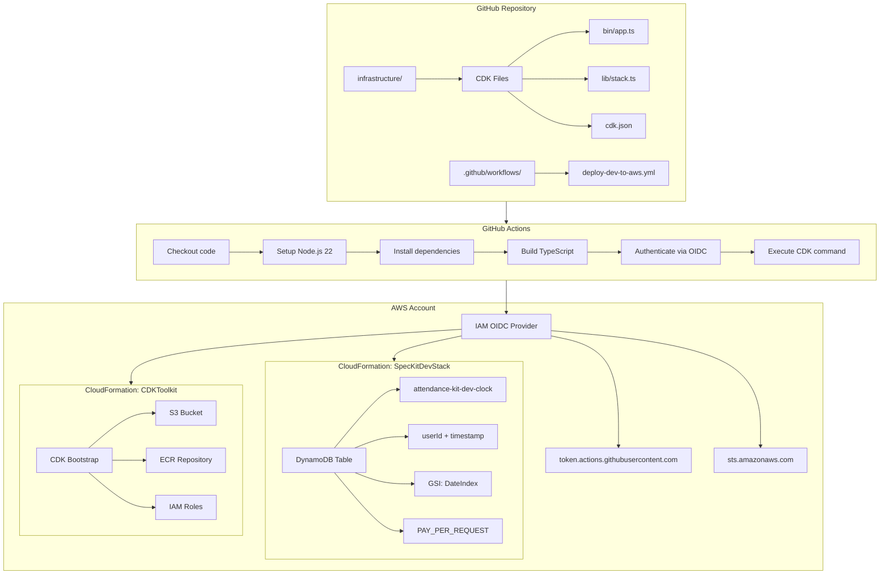

# 技術実装計画: AWS DynamoDB Clock Table CI/CD

**機能ブランチ**: `copilot/build-ci-for-aws-deployment`  
**作成日**: 2025-12-25  
**ステータス**: レビュー待ち  
**仕様書**: [spec.md](./spec.md)

## 1. 技術スタック選定

### 1.1 インフラストラクチャ

- **AWS CDK**: v2.x (TypeScript)
  - 理由: Infrastructure as Code、型安全性、CloudFormation抽象化
  - 代替案検討: Terraform → 却下（AWS特化でCDKの方が開発効率が高い）

- **DynamoDB**: On-Demand課金モード
  - 理由: サーバーレス、スケーラブル、低トラフィック時のコスト効率
  - 設定:
    - PITR有効化（データ保護）
    - AWS管理キー暗号化（セキュリティ）
    - RETAIN削除ポリシー（誤削除防止）

### 1.2 CI/CD

- **GitHub Actions**: ワークフロー実行環境
  - 理由: GitHub統合、OIDC対応、無料枠で十分
  - ランナー: ubuntu-latest
  - Node.js: v22 (LTS)

- **OIDC認証**: AWS認証方式
  - 理由: 認証情報保存不要、セキュリティベストプラクティス
  - 設定: GitHub OIDC Provider + IAM Role

### 1.3 開発ツール

- **TypeScript**: v5.x
- **AWS CDK CLI**: グローバルまたはnpx経由
- **Node.js**: v22 LTS

## 2. アーキテクチャ設計

### 2.1 システム構成図



### 2.2 デプロイメントフロー

#### 自動デプロイ (deploy-dev-to-aws.yml)


#### 手動Bootstrap (cdk-bootstrap.yml)


## 3. CDKスタック構造

### 3.1 ディレクトリ構成

```
infrastructure/
├── bin/
│   └── app.ts                    # CDKアプリエントリーポイント
├── lib/
│   └── spec-kit-stack.ts         # DynamoDBスタック定義（環境パラメータ対応）
├── test/
│   └── spec-kit-stack.test.ts    # ユニットテスト
├── cdk.json                       # CDK設定
├── package.json                   # 依存関係
├── tsconfig.json                  # TypeScript設定
└── README.md                      # セットアップ手順
```

### 3.2 CDK Stack実装詳細

#### bin/app.ts
```typescript
#!/usr/bin/env node
import 'source-map-support/register';
import * as cdk from 'aws-cdk-lib';
import { SpecKitStack } from '../lib/spec-kit-stack';

const app = new cdk.App();

// 環境パラメータ（コンテキストまたは環境変数から取得）
const environment = app.node.tryGetContext('environment') || process.env.ENVIRONMENT || 'dev';

// 環境設定
const env = {
  account: process.env.CDK_DEFAULT_ACCOUNT,
  region: process.env.CDK_DEFAULT_REGION || 'ap-northeast-1',
};

// Stackインスタンス作成（環境をパラメータとして渡す）
new SpecKitStack(app, `AttendanceKit-${environment.charAt(0).toUpperCase() + environment.slice(1)}-Stack`, {
  env,
  environment,
  description: `DynamoDB clock table for attendance-kit (${environment} environment)`,
  tags: {
    Environment: environment,
    Project: 'attendance-kit',
    ManagedBy: 'CDK',
  },
});

app.synth();
```

#### lib/spec-kit-stack.ts
```typescript
import * as cdk from 'aws-cdk-lib';
import { Construct } from 'constructs';
import * as dynamodb from 'aws-cdk-lib/aws-dynamodb';
import * as iam from 'aws-cdk-lib/aws-iam';

export interface SpecKitStackProps extends cdk.StackProps {
  environment: string; // 'dev' | 'staging'
  githubRepository?: string; // GitHub repository name for OIDC
}

export class SpecKitStack extends cdk.Stack {
  constructor(scope: Construct, id: string, props: SpecKitStackProps) {
    super(scope, id, props);

    const { environment, githubRepository = 'goataka/attendance-kit' } = props;

    // OIDC Provider for GitHub Actions
    const githubProvider = new iam.OpenIdConnectProvider(this, 'GitHubProvider', {
      url: 'https://token.actions.githubusercontent.com',
      clientIds: ['sts.amazonaws.com'],
    });

    // IAM Role for GitHub Actions with OIDC
    const githubActionsRole = new iam.Role(this, 'GitHubActionsRole', {
      assumedBy: new iam.FederatedPrincipal(
        githubProvider.openIdConnectProviderArn,
        {
          StringEquals: {
            'token.actions.githubusercontent.com:aud': 'sts.amazonaws.com',
          },
          StringLike: {
            'token.actions.githubusercontent.com:sub': `repo:${githubRepository}:*`,
          },
        },
        'sts:AssumeRoleWithWebIdentity'
      ),
      description: `Role for GitHub Actions to deploy infrastructure (${environment})`,
      roleName: `GitHubActionsDeployRole-${environment}`,
      maxSessionDuration: cdk.Duration.hours(1),
    });

    // Attach necessary policies for deployment
    // NOTE: PowerUserAccessを使用（初期段階では簡易設定、本番環境では最小権限に変更すべき）
    githubActionsRole.addManagedPolicy(
      iam.ManagedPolicy.fromAwsManagedPolicyName('PowerUserAccess')
    );
    
    // Additional IAM permissions for CDK operations
    // セキュリティ要件: リソースを特定のパターンにスコープし、ワイルドカードを回避
    githubActionsRole.addToPolicy(new iam.PolicyStatement({
      effect: iam.Effect.ALLOW,
      actions: [
        'iam:CreateRole',
        'iam:DeleteRole',
        'iam:AttachRolePolicy',
        'iam:DetachRolePolicy',
        'iam:PutRolePolicy',
        'iam:DeleteRolePolicy',
        'iam:GetRole',
        'iam:PassRole',
        'iam:CreateOpenIDConnectProvider',
        'iam:DeleteOpenIDConnectProvider',
        'iam:GetOpenIDConnectProvider',
        'iam:TagOpenIDConnectProvider',
      ],
      resources: [
        'arn:aws:iam::*:role/cdk-*',
        `arn:aws:iam::*:role/GitHubActionsDeployRole-${environment}`,
        'arn:aws:iam::*:oidc-provider/token.actions.githubusercontent.com',
      ],
    }));

    // DynamoDB Clock Table（環境ごとに異なるテーブル名）
    const clockTable = new dynamodb.Table(this, 'ClockTable', {
      tableName: `attendance-kit-${environment}-clock`,
      partitionKey: {
        name: 'userId',
        type: dynamodb.AttributeType.STRING,
      },
      sortKey: {
        name: 'timestamp',
        type: dynamodb.AttributeType.STRING,
      },
      billingMode: dynamodb.BillingMode.PAY_PER_REQUEST,
      encryption: dynamodb.TableEncryption.AWS_MANAGED,
      pointInTimeRecovery: true,
      removalPolicy: cdk.RemovalPolicy.RETAIN, // データ保護
    });

    // Global Secondary Index: DateIndex
    clockTable.addGlobalSecondaryIndex({
      indexName: 'DateIndex',
      partitionKey: {
        name: 'date',
        type: dynamodb.AttributeType.STRING,
      },
      sortKey: {
        name: 'timestamp',
        type: dynamodb.AttributeType.STRING,
      },
      projectionType: dynamodb.ProjectionType.ALL,
    });

    // CloudFormation Outputs（環境ごとに異なるExport名）
    new cdk.CfnOutput(this, 'TableName', {
      value: clockTable.tableName,
      description: `DynamoDB clock table name (${environment})`,
      exportName: `AttendanceKit-${environment.charAt(0).toUpperCase() + environment.slice(1)}-ClockTableName`,
    });

    new cdk.CfnOutput(this, 'TableArn', {
      value: clockTable.tableArn,
      description: `DynamoDB clock table ARN (${environment})`,
      exportName: `AttendanceKit-${environment.charAt(0).toUpperCase() + environment.slice(1)}-ClockTableArn`,
    });

    new cdk.CfnOutput(this, 'GitHubActionsRoleArn', {
      value: githubActionsRole.roleArn,
      description: `IAM Role ARN for GitHub Actions (${environment})`,
      exportName: `AttendanceKit-${environment.charAt(0).toUpperCase() + environment.slice(1)}-GitHubActionsRoleArn`,
    });

    new cdk.CfnOutput(this, 'OIDCProviderArn', {
      value: githubProvider.openIdConnectProviderArn,
      description: `OIDC Provider ARN for GitHub Actions (${environment})`,
      exportName: `AttendanceKit-${environment.charAt(0).toUpperCase() + environment.slice(1)}-OIDCProviderArn`,
    });
  }
}
```

### 3.3 依存関係 (package.json)

```json
{
  "name": "attendance-kit-infrastructure",
  "version": "1.0.0",
  "scripts": {
    "build": "tsc",
    "watch": "tsc -w",
    "test": "jest",
    "cdk": "cdk"
  },
  "devDependencies": {
    "@types/jest": "^29.5.0",
    "@types/node": "22.x",
    "aws-cdk": "^2.x",
    "jest": "^29.5.0",
    "ts-jest": "^29.1.0",
    "ts-node": "^10.9.1",
    "typescript": "~5.3.0"
  },
  "dependencies": {
    "aws-cdk-lib": "^2.x",
    "constructs": "^10.0.0",
    "source-map-support": "^0.5.21"
  }
}
```

## 4. GitHub Actions ワークフロー設計

### 4.1 Deploy Workflow (.github/workflows/deploy-to-aws.yml)

```yaml
name: Deploy to AWS

on:
  push:
    branches:
      - main
    paths:
      - 'infrastructure/**'
  workflow_dispatch:
    inputs:
      environment:
        description: 'Environment to deploy'
        required: true
        default: 'dev'
        type: choice
        options:
          - dev
          - staging

permissions:
  id-token: write   # OIDC認証に必要
  contents: read

jobs:
  deploy:
    runs-on: ubuntu-latest
    environment: ${{ inputs.environment || 'dev' }}
    
    steps:
      - name: Checkout code
        uses: actions/checkout@v4

      - name: Setup Node.js 22
        uses: actions/setup-node@v4
        with:
          node-version: '22'
          cache: 'npm'
          cache-dependency-path: infrastructure/package-lock.json

      - name: Install dependencies
        working-directory: infrastructure
        run: npm ci

      - name: Build TypeScript
        working-directory: infrastructure
        run: npm run build

      - name: Configure AWS credentials via OIDC
        uses: aws-actions/configure-aws-credentials@v4
        with:
          role-to-assume: ${{ secrets.AWS_ROLE_TO_ASSUME }}
          aws-region: ap-northeast-1

      - name: CDK Bootstrap
        working-directory: infrastructure
        env:
          ENVIRONMENT: ${{ inputs.environment || 'dev' }}
        run: |
          echo "Running CDK bootstrap (idempotent operation)..."
          ACCOUNT_ID=$(aws sts get-caller-identity --query Account --output text)
          npx cdk bootstrap aws://${ACCOUNT_ID}/ap-northeast-1 \
            --context environment=${ENVIRONMENT}

      - name: CDK Synth
        working-directory: infrastructure
        env:
          ENVIRONMENT: ${{ inputs.environment || 'dev' }}
        run: npx cdk synth --context environment=${ENVIRONMENT}

      - name: CDK Deploy
        working-directory: infrastructure
        env:
          ENVIRONMENT: ${{ inputs.environment || 'dev' }}
        run: npx cdk deploy --require-approval never --all --context environment=${ENVIRONMENT}

      - name: Output deployment results
        env:
          ENVIRONMENT: ${{ inputs.environment || 'dev' }}
        run: |
          echo "Deployment completed successfully for environment: ${ENVIRONMENT}"
          STACK_NAME="AttendanceKit-$(echo ${ENVIRONMENT} | sed 's/.*/\u&/')-Stack"
          echo "Stack outputs:"
          aws cloudformation describe-stacks \
            --stack-name ${STACK_NAME} \
            --query 'Stacks[0].Outputs' \
            --output table
```

## 5. OIDC認証フロー

### 5.1 初回セットアップ（CloudFormation - CDK管理へ移行）

#### ステップ1: 初回のみCloudFormationでOIDCプロバイダーとIAMロールを作成

初回のみ、CloudFormationテンプレートを使用してOIDCプロバイダーとIAMロールを作成します。

**CloudFormationテンプレート (bootstrap-oidc.yaml)**:
```yaml
AWSTemplateFormatVersion: '2010-09-09'
Description: 'GitHub Actions OIDC Provider and IAM Role for initial bootstrap'

Parameters:
  GitHubOrg:
    Type: String
    Default: goataka
    Description: GitHub organization or username
  
  GitHubRepo:
    Type: String
    Default: attendance-kit
    Description: GitHub repository name
  
  RoleName:
    Type: String
    Default: GitHubActionsDeployRole-Initial
    Description: Name of the IAM role for GitHub Actions

Resources:
  GitHubOIDCProvider:
    Type: AWS::IAM::OIDCProvider
    Properties:
      Url: https://token.actions.githubusercontent.com
      ClientIdList:
        - sts.amazonaws.com
      ThumbprintList:
        - 6938fd4d98bab03faadb97b34396831e3780aea1
  
  GitHubActionsRole:
    Type: AWS::IAM::Role
    Properties:
      RoleName: !Ref RoleName
      AssumeRolePolicyDocument:
        Version: '2012-10-17'
        Statement:
          - Effect: Allow
            Principal:
              Federated: !GetAtt GitHubOIDCProvider.Arn
            Action: sts:AssumeRoleWithWebIdentity
            Condition:
              StringEquals:
                token.actions.githubusercontent.com:aud: sts.amazonaws.com
              StringLike:
                token.actions.githubusercontent.com:sub: !Sub 'repo:${GitHubOrg}/${GitHubRepo}:*'
      ManagedPolicyArns:
        - arn:aws:iam::aws:policy/PowerUserAccess
      Policies:
        - PolicyName: AdditionalIAMPermissions
          PolicyDocument:
            Version: '2012-10-17'
            Statement:
              - Effect: Allow
                Action:
                  - iam:CreateRole
                  - iam:DeleteRole
                  - iam:AttachRolePolicy
                  - iam:DetachRolePolicy
                  - iam:PutRolePolicy
                  - iam:DeleteRolePolicy
                  - iam:GetRole
                  - iam:GetRolePolicy
                  - iam:ListRolePolicies
                  - iam:ListAttachedRolePolicies
                  - iam:TagRole
                  - iam:UntagRole
                  - iam:CreateOpenIDConnectProvider
                  - iam:DeleteOpenIDConnectProvider
                  - iam:GetOpenIDConnectProvider
                  - iam:TagOpenIDConnectProvider
                  - iam:UntagOpenIDConnectProvider
                Resource:
                  - !Sub 'arn:aws:iam::${AWS::AccountId}:role/cdk-*'
                  - !Sub 'arn:aws:iam::${AWS::AccountId}:role/GitHubActionsDeployRole-*'
                  - !Sub 'arn:aws:iam::${AWS::AccountId}:oidc-provider/token.actions.githubusercontent.com'
      Description: Role for GitHub Actions to deploy infrastructure (initial bootstrap)

Outputs:
  OIDCProviderArn:
    Description: ARN of the GitHub OIDC Provider
    Value: !GetAtt GitHubOIDCProvider.Arn
  
  RoleArn:
    Description: ARN of the GitHub Actions IAM Role
    Value: !GetAtt GitHubActionsRole.Arn
  
  RoleName:
    Description: Name of the GitHub Actions IAM Role
    Value: !Ref GitHubActionsRole
  
  GitHubSecretValue:
    Description: Value to set in GitHub Secrets as AWS_ROLE_TO_ASSUME
    Value: !GetAtt GitHubActionsRole.Arn
  
  NextSteps:
    Description: Next steps after deploying this stack
    Value: |
      1. Copy the GitHubSecretValue output and set it as AWS_ROLE_TO_ASSUME in GitHub Secrets
      2. Run CDK bootstrap
      3. Deploy the CDK stack (which will create CDK-managed OIDC and IAM role)
      4. Update GitHub Secret AWS_ROLE_TO_ASSUME with the CDK-managed role ARN
      5. Delete this CloudFormation stack to remove bootstrap resources
```

**デプロイ方法**:

AWSコンソールから:
1. CloudFormationサービスを開く
2. 新しいスタックを作成
3. `bootstrap-oidc.yaml` をアップロード
4. パラメータを確認・調整（必要に応じて）
5. スタックを作成
6. Outputs タブから `GitHubSecretValue` をコピーし、GitHub Secretsに設定

#### ステップ2: CDKでOIDCとIAMロールを管理

初回デプロイ後は、CDKでOIDCプロバイダーとIAMロールを管理します。

**CDKスタックでの実装**:
```typescript
import * as iam from 'aws-cdk-lib/aws-iam';

// OIDC Provider for GitHub Actions
const githubProvider = new iam.OpenIdConnectProvider(this, 'GitHubProvider', {
  url: 'https://token.actions.githubusercontent.com',
  clientIds: ['sts.amazonaws.com'],
});

// IAM Role for GitHub Actions
const githubActionsRole = new iam.Role(this, 'GitHubActionsRole', {
  assumedBy: new iam.FederatedPrincipal(
    githubProvider.openIdConnectProviderArn,
    {
      StringEquals: {
        'token.actions.githubusercontent.com:aud': 'sts.amazonaws.com',
      },
      StringLike: {
        'token.actions.githubusercontent.com:sub': `repo:goataka/attendance-kit:*`,
      },
    },
    'sts:AssumeRoleWithWebIdentity'
  ),
  description: 'Role for GitHub Actions to deploy infrastructure',
  roleName: `GitHubActionsDeployRole-${environment}`,
});

// 必要な権限をアタッチ
githubActionsRole.addManagedPolicy(
  iam.ManagedPolicy.fromAwsManagedPolicyName('PowerUserAccess')
);
```

#### ステップ3: Bootstrap CloudFormationスタックを削除

CDKでOIDCとIAMロールがデプロイされた後、初回に作成したCloudFormationスタックを削除します。

AWSコンソールから:
1. CloudFormationサービスを開く
2. Bootstrap用のスタック（例: `github-oidc-bootstrap`）を選択
3. 「削除」をクリック
4. 確認後、スタックが削除されることを確認

これにより、以降はCDK管理のOIDCとIAMロールのみが使用されます。

### 5.2 IAM Policy (最小権限)
```json
{
  "Version": "2012-10-17",
  "Statement": [
    {
      "Sid": "AllowCloudFormationForProjectStacks",
      "Effect": "Allow",
      "Action": [
        "cloudformation:CreateStack",
        "cloudformation:UpdateStack",
        "cloudformation:DeleteStack",
        "cloudformation:DescribeStacks",
        "cloudformation:DescribeStackEvents",
        "cloudformation:GetTemplate",
        "cloudformation:ValidateTemplate",
        "cloudformation:ListStacks"
      ],
      "Resource": [
        "arn:aws:cloudformation:*:*:stack/attendance-kit-*",
        "arn:aws:cloudformation:*:*:stack/CDKToolkit/*"
      ]
    },
    {
      "Sid": "AllowDynamoDBForClockTable",
      "Effect": "Allow",
      "Action": [
        "dynamodb:CreateTable",
        "dynamodb:UpdateTable",
        "dynamodb:DeleteTable",
        "dynamodb:DescribeTable",
        "dynamodb:DescribeContinuousBackups",
        "dynamodb:UpdateContinuousBackups",
        "dynamodb:DescribeTimeToLive",
        "dynamodb:UpdateTimeToLive",
        "dynamodb:ListTagsOfResource",
        "dynamodb:TagResource",
        "dynamodb:UntagResource"
      ],
      "Resource": "arn:aws:dynamodb:*:*:table/attendance-kit-*-clock"
    },
    {
      "Sid": "AllowS3ForCdkBootstrapBucket",
      "Effect": "Allow",
      "Action": [
        "s3:GetObject",
        "s3:PutObject",
        "s3:DeleteObject",
        "s3:ListBucket",
        "s3:GetBucketLocation",
        "s3:GetBucketPolicy"
      ],
      "Resource": [
        "arn:aws:s3:::cdk-*-assets-*",
        "arn:aws:s3:::cdk-*-assets-*/*"
      ]
    },
    {
      "Sid": "AllowPassCdkRolesToCloudFormation",
      "Effect": "Allow",
      "Action": [
        "iam:GetRole",
        "iam:PassRole"
      ],
      "Resource": [
        "arn:aws:iam::*:role/cdk-*-cfn-exec-role-*",
        "arn:aws:iam::*:role/cdk-*-deploy-role-*"
      ]
    },
    {
      "Sid": "AllowSTSForIdentity",
      "Effect": "Allow",
      "Action": "sts:GetCallerIdentity",
      "Resource": "*"
    },
    {
      "Sid": "AllowSSMForCdkBootstrap",
      "Effect": "Allow",
      "Action": [
        "ssm:GetParameter"
      ],
      "Resource": "arn:aws:ssm:*:*:parameter/cdk-bootstrap/*"
    }
  ]
}
```

### 5.3 GitHub Secrets設定

初回セットアップ時のみ、手動作成したIAMロールのARNを設定します。CDKデプロイ後は、CDK管理のロールARNに更新します。

| Secret名 | 値 | 説明 |
|----------|-----|------|
| `AWS_ROLE_TO_ASSUME` | 初回: `arn:aws:iam::{ACCOUNT_ID}:role/GitHubActionsDeployRole`<br/>CDK管理後: CloudFormation出力から取得 | OIDCで引き受けるIAMロールARN |

## 6. DynamoDB設計詳細

### 6.1 テーブル構造

#### Primary Key
- **Partition Key**: `userId` (String)
  - ユーザーごとにデータを分散
  - ユーザー単位のクエリに最適化
  
- **Sort Key**: `timestamp` (String, ISO 8601)
  - 時系列順にソート
  - 範囲クエリ対応 (特定期間の打刻取得)

#### Global Secondary Index: DateIndex
- **Partition Key**: `date` (String, YYYY-MM-DD)
  - 日付単位でデータ分散
  - 特定日の全ユーザー打刻取得に最適化
  
- **Sort Key**: `timestamp` (String)
  - 日付内で時系列順ソート

#### 属性
```typescript
{
  userId: string,        // PK: ユーザーID
  timestamp: string,     // SK: ISO 8601形式 (例: "2025-12-25T09:00:00Z")
  date: string,          // GSI PK: YYYY-MM-DD形式 (例: "2025-12-25")
  type: string,          // "clock-in" | "clock-out"
  location?: string,     // オプション: 打刻場所
  deviceId?: string,     // オプション: デバイスID
}
```

### 6.2 クエリパターン

#### パターン1: 特定ユーザーの全打刻取得
```typescript
// Primary Key Query
const params = {
  TableName: 'attendance-kit-dev-clock',
  KeyConditionExpression: 'userId = :userId',
  ExpressionAttributeValues: {
    ':userId': 'user123'
  }
};
```

#### パターン2: 特定ユーザーの期間指定打刻取得
```typescript
// Primary Key + Range Query
const params = {
  TableName: 'attendance-kit-dev-clock',
  KeyConditionExpression: 'userId = :userId AND #timestamp BETWEEN :start AND :end',
  ExpressionAttributeNames: {
    '#timestamp': 'timestamp'
  },
  ExpressionAttributeValues: {
    ':userId': 'user123',
    ':start': '2025-12-01T00:00:00Z',
    ':end': '2025-12-31T23:59:59Z'
  }
};
```

#### パターン3: 特定日の全ユーザー打刻取得
```typescript
// GSI Query
const params = {
  TableName: 'attendance-kit-dev-clock',
  IndexName: 'DateIndex',
  KeyConditionExpression: '#date = :date',
  ExpressionAttributeNames: {
    '#date': 'date'
  },
  ExpressionAttributeValues: {
    ':date': '2025-12-25'
  }
};
```

### 6.3 データ保護戦略

- **Point-in-Time Recovery (PITR)**: 35日間の継続バックアップ
- **AWS Managed Encryption**: 保存時暗号化
- **RETAIN Removal Policy**: CloudFormationスタック削除時もテーブル保持
- **On-Demand Billing**: トラフィック急増時も自動スケール

## 7. セキュリティ考慮事項

### 7.1 認証・認可

- ✅ OIDC使用により永続認証情報不要
- ✅ IAMロールは最小権限原則に従う
- ✅ GitHub環境ごとに異なる認証情報使用可能

### 7.2 データ保護

- ✅ 保存時暗号化 (AWS Managed Key)
- ✅ 転送時暗号化 (HTTPS)
- ✅ PITR有効化 (誤削除・誤更新対策)
- ✅ RETAIN削除ポリシー (CloudFormation誤削除対策)

### 7.3 アクセス制御

- ✅ IAMロールによるAWSリソースアクセス制御
- ✅ GitHub環境シークレットによる機密情報保護
- ✅ リポジトリ限定のOIDC信頼ポリシー

### 7.4 監査・ログ

- ✅ CloudFormationイベントログ
- ✅ GitHub Actions実行ログ
- ✅ AWS CloudTrail (DynamoDB API呼び出し記録)

## 8. デプロイメント戦略

### 8.1 初回セットアップ手順（CloudFormation Bootstrap → CDK管理へ移行）

#### フェーズ1: CloudFormationでBootstrap

1. **CloudFormationスタックデプロイ** (初回のみ)
   - AWSコンソールでCloudFormationサービスを開く
   - 新しいスタックを作成
   - `bootstrap-oidc.yaml` テンプレートをアップロード
   - パラメータを確認（GitHubOrg、GitHubRepo、RoleName）
   - スタックを作成

2. **GitHub Secrets設定**
   - CloudFormationのOutputsタブから `GitHubSecretValue` をコピー
   - GitHub リポジトリのSettings > Secrets and variables > Actionsを開く
   - `AWS_ROLE_TO_ASSUME` に取得したロールARNを設定

3. **CDK Bootstrap実行** (GitHub Actions手動トリガー)
   - ワークフロー: デプロイワークフロー内で自動実行
   - 環境: dev

#### フェーズ2: CDKデプロイとOIDC管理移行

4. **初回デプロイ実行** (GitHub Actions手動トリガー)
   - ワークフロー: `deploy-dev-to-aws.yml`
   - 入力: dev
   - このデプロイでCDK管理のOIDCプロバイダーとIAMロールが作成される

5. **GitHub Secretsの更新**
   - CloudFormation出力から新しいCDK管理ロールARNを取得
   - `AWS_ROLE_TO_ASSUME`をCDK管理のロールARNに更新

6. **Bootstrap CloudFormationスタックの削除**
   - AWSコンソールでCloudFormationサービスを開く
   - Bootstrap用のスタック（例: `github-oidc-bootstrap`）を選択
   - 「削除」をクリック
   - スタックが削除されることを確認

7. **動作確認**
   - 再度デプロイワークフローを実行し、CDK管理のOIDCで認証できることを確認

### 8.2 通常運用時のデプロイ（CDK管理後）

1. **開発者がinfrastructure/配下を変更**
2. **PRを作成し、レビュー**
3. **mainブランチにマージ**
4. **GitHub Actionsが自動実行**
5. **DynamoDBテーブル更新**
6. **CloudFormation出力を確認**

### 8.3 ロールバック戦略

- CloudFormationの自動ロールバック機能を活用
- デプロイ失敗時は前の安定状態に自動復帰
- 手動ロールバック: 以前のCloudFormationスタックバージョンに戻す

## 9. テスト戦略

### 9.1 単体テスト (CDKスタック)

```typescript
// test/spec-kit-dev-stack.test.ts
import { Template } from 'aws-cdk-lib/assertions';
import { App } from 'aws-cdk-lib';
import { SpecKitDevStack } from '../lib/spec-kit-dev-stack';

test('DynamoDB Table Created', () => {
  const app = new App();
  const stack = new SpecKitDevStack(app, 'TestStack');
  const template = Template.fromStack(stack);

  template.hasResourceProperties('AWS::DynamoDB::Table', {
    TableName: 'attendance-kit-dev-clock',
    BillingMode: 'PAY_PER_REQUEST',
    PointInTimeRecoverySpecification: {
      PointInTimeRecoveryEnabled: true
    }
  });
});

test('Global Secondary Index Created', () => {
  const app = new App();
  const stack = new SpecKitDevStack(app, 'TestStack');
  const template = Template.fromStack(stack);

  template.hasResourceProperties('AWS::DynamoDB::Table', {
    GlobalSecondaryIndexes: [
      {
        IndexName: 'DateIndex',
        KeySchema: [
          { AttributeName: 'date', KeyType: 'HASH' },
          { AttributeName: 'timestamp', KeyType: 'RANGE' }
        ]
      }
    ]
  });
});
```

### 9.2 統合テスト (デプロイ後)

1. **テーブル存在確認**
   ```bash
   aws dynamodb describe-table --table-name attendance-kit-dev-clock
   ```

2. **書き込みテスト**
   ```bash
   aws dynamodb put-item \
     --table-name attendance-kit-dev-clock \
     --item '{
       "userId": {"S": "test-user"},
       "timestamp": {"S": "2025-12-25T09:00:00Z"},
       "date": {"S": "2025-12-25"},
       "type": {"S": "clock-in"}
     }'
   ```

3. **クエリテスト (Primary Key)**
   ```bash
   aws dynamodb query \
     --table-name attendance-kit-dev-clock \
     --key-condition-expression "userId = :userId" \
     --expression-attribute-values '{":userId":{"S":"test-user"}}'
   ```

4. **クエリテスト (GSI)**
   ```bash
   aws dynamodb query \
     --table-name attendance-kit-dev-clock \
     --index-name DateIndex \
     --key-condition-expression "#date = :date" \
     --expression-attribute-names '{"#date":"date"}' \
     --expression-attribute-values '{":date":{"S":"2025-12-25"}}'
   ```

### 9.3 GitHub Actions ワークフローテスト

1. **Deploy Workflow**: PR作成してdry-run確認後、mainマージで実行

## 10. モニタリング・運用（コスト最小化版）

### 10.1 CloudFormationスタック監視

- AWS CloudFormationコンソールでスタックステータス確認
- デプロイ履歴とイベントログ確認

### 10.2 基本的なDynamoDBメトリクス監視（無料）

- CloudWatch メトリクス（基本メトリクス - 無料）:
  - ConsumedReadCapacityUnits (読み込み使用量)
  - ConsumedWriteCapacityUnits (書き込み使用量)
  - UserErrors (クライアントエラー)
  - SystemErrors (サーバーエラー)

**注意**: 初期段階ではコスト削減のため、以下は実装しません:
- CloudWatchアラーム（スロットルアラームなど）
- カスタムメトリクス
- 詳細なモニタリング
- SNS通知

### 10.3 GitHub Actions実行監視

- ワークフロー実行履歴確認
- 失敗時のログ分析
- 成功率トラッキング

## 11. ドキュメント作成計画

### 11.1 アーキテクチャドキュメント (docs/architecture/)

- `aws-clock-table-infrastructure.md`: インフラストラクチャ設計詳細
- `dynamodb-schema.md`: テーブル設計とクエリパターン
- `cicd-workflow.md`: CI/CDワークフロー説明
- `oidc-authentication.md`: OIDC認証フロー（CDK管理への移行を含む）

### 11.2 ビジネスドキュメント (docs/business/)

- `clock-table-requirements.md`: ビジネス要件
- `deployment-workflow.md`: デプロイメントフロー（ビジネス視点）

### 11.3 セットアップガイド

- `infrastructure/README.md`: 開発者向けセットアップ手順
- OIDC設定手順
- CDK bootstrap手順
- 初回デプロイ手順

## 12. リスクと対策

| リスク | 影響 | 対策 |
|--------|------|------|
| OIDC認証失敗 | デプロイ不可 | IAMロール・Trust Policy再確認、GitHub Actions permissionsチェック |
| CloudFormation失敗 | サービス停止 | 自動ロールバック有効、変更セットレビュー徹底 |
| 誤ってテーブル削除 | データ損失 | RETAIN削除ポリシー設定、PITR有効化 |
| コスト超過 | 予算オーバー | On-Demand課金でスケール、CloudWatch請求アラート設定 |
| CDK bootstrap忘れ | デプロイ失敗 | ドキュメント明記、エラーメッセージで案内 |
| 同時デプロイ | スタックロック | CloudFormationが自動制御、エラー時は再実行 |

## 13. 実装タスク概要

実装は以下のフェーズで進める（詳細は tasks.md で定義）:

### Phase 1: CDKインフラストラクチャ (P1)
- CDKプロジェクト初期化
- DynamoDBスタック実装
- 単体テスト作成

### Phase 2: GitHub Actionsワークフロー (P1)
- Deploy ワークフロー作成
- OIDC認証設定

### Phase 3: ドキュメント (P1-P2)
- アーキテクチャドキュメント作成
- セットアップガイド作成
- ビジネスドキュメント作成

### Phase 4: テスト・検証 (P1)
- 統合テスト実行
- エンドツーエンドテスト
- セキュリティ検証

## 14. 成功基準の検証方法

| 成功基準 | 検証方法 |
|---------|---------|
| SC-001: 5分以内デプロイ | GitHub Actions実行時間計測 |
| SC-002: 95%成功率 | 過去10回のデプロイ結果確認 |
| SC-003: データ保持 | CloudFormationスタック削除テスト |
| SC-004: 認証情報なし | GitHub Secretsスキャン、OIDC使用確認 |
| SC-005: 10分以内自動デプロイ | mainマージ後の自動実行時間計測 |
| SC-006: 30分で理解可能 | 開発者にドキュメントレビュー依頼 |
| SC-007: 3分以内bootstrap | GitHub Actions bootstrap実行時間計測 |
| SC-008: Bootstrap冪等性 | 同環境で複数回実行テスト |

## 15. 次のステップ

1. **`/tasks`**: このプランを実装タスクに分解
2. **`/implement`**: タスクを順次実装
3. **ドキュメント作成**: 実装と同時に docs/ 配下を更新
4. **レビュー**: コードレビューとテスト実行
5. **デプロイ**: 本番環境への適用

---

**レビュアー向けチェックリスト**:
- [ ] 技術スタック選定は適切か？
- [ ] アーキテクチャ設計は拡張性があるか？
- [ ] セキュリティ対策は十分か？
- [ ] テスト戦略は包括的か？
- [ ] ドキュメント計画は明確か？
- [ ] リスク対策は妥当か？
